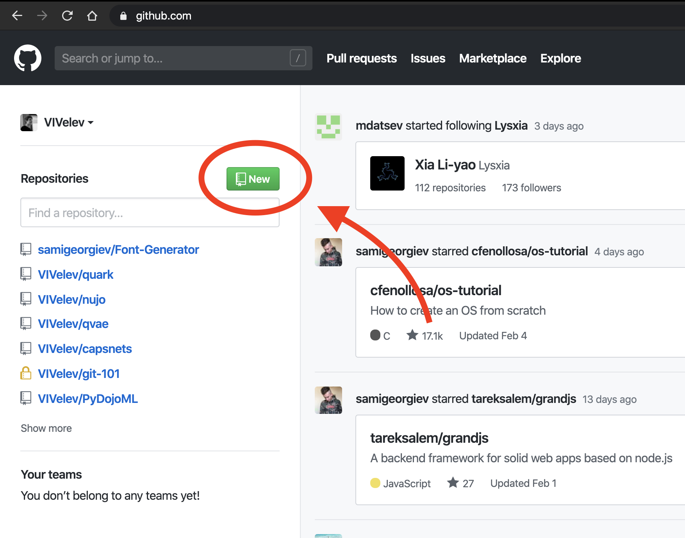
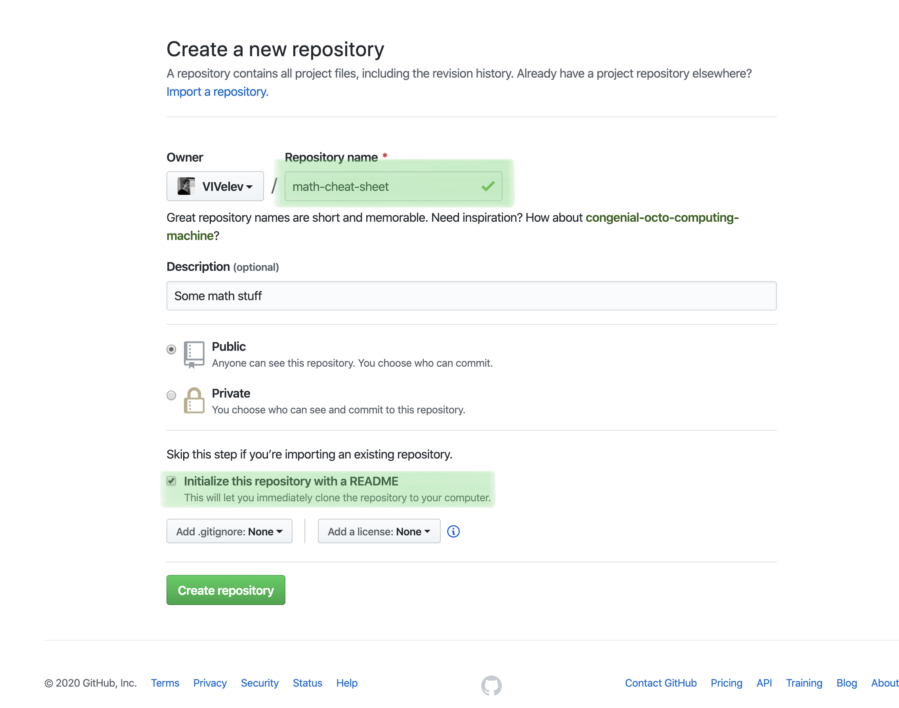

# Create a new repository on GitHub
If you only want to keep track of your code locally, you don't need to use GitHub.
But if you want to work with a team, you can use GitHub to collaboratively modify the project's code.

## To create a new repo on GitHub, log in and go to the GitHub home page. You should see a green 'New' button:

## Click it. This will open a new window asking you for:
- Name
- Description (optional)
- And don't forget to check the 'Initialize this repository with README' checkbox (this will allow us to clone, quickly)

## Now click 'Create repository'. You should see something like this:

