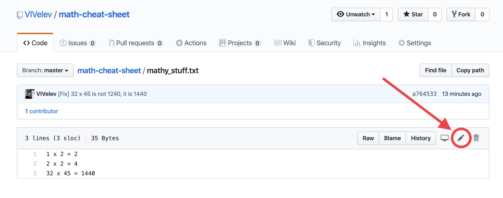

# How to edit file through GitHub.

Go to your repo in Github and click on `mathy_stuff.txt`. <br>
Then, click on the pen icon:


As I said, we are gonna make some mess ;).
Do what ever you like. I will paste the following in my file:
```
1 x 2 = 2
blablabla
tralalal tralala
```

Finally, click on the big green button `Commit changes`.
