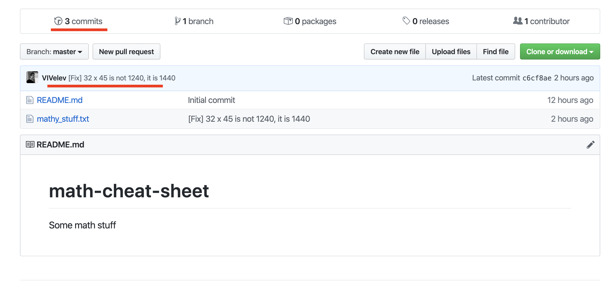

# Publishing local commits.

We have seen from `git status` that out local repo is ahead of **origin/master**. <br>
So how do we "publish" (**push**) our local commits? <br>
You guessed it, simple:
```bash
$ git push
```
That is all.

## Lets go to the online github repository: https://github.com/*username*/math-cheat-sheet
You should see something like this:


We can see that GitHub accurately shows that 3 commits were made and also the message of the last commit.

## Ok, great! Let's do some mess now, online with GitHub.

