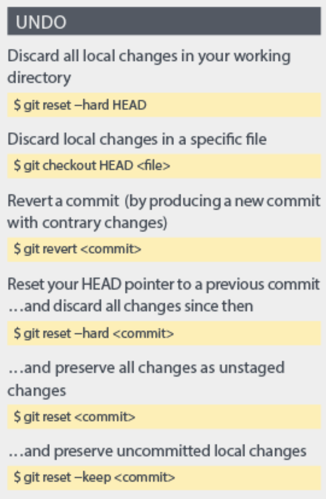

# Ctrl-Z, Ctrl-Z, Ctrl-Z ...
Last time we made some mess, lets pretend that it didn't happen by, well, undoing it.

## What is the Ctrl-Z equivalent in git?
```bash
$ git revert <commit>
```
Where commit is guess what. The unique commit identifier. <br>
I hope you now see why this is useful.

You can think of `git revert` as equivalent to `git undo`.

## Which commit do we want to undo?
```bash
$ git log
commit 359ca1e79c18c887268cb657ed170bef3ac4b5e5 (HEAD -> master, origin/master, origin/HEAD)
Author: Victor Velev <victorivelev@gmail.com>
Date:   Thu Feb 20 00:23:35 2020 +0200

    Update mathy_stuff.txt

commit a7645336113859835392685b38b57359d7ebc4e1
Author: Victor Velev <victorivelev@gmail.com>
Date:   Thu Feb 20 00:05:09 2020 +0200

    [Fix] 32 x 45 is not 1240, it is 1440

...
```

Lets go back to the moment when we fixed the `mathy_stuff.txt`.
So undo commit `359ca1e79c18c887268cb657ed170bef3ac4b5e5`
```bash
$ git revert 359ca1e79c18c887268cb657ed170bef3ac4b5e5
```

This will open a file, created by git, containing a commit message in a text editor, usually vim.
Edit the message as you like. Then, we need to save and quit this file. In vim this is done by clicking
`esc` and then typing `:wq` for *write*, *quit*.

Finally, something like this should show up:
```bash
[master ccfad91] Revert "Update mathy_stuff.txt"
 1 file changed, 2 insertions(+), 2 deletions(-)
```
This tells us that we have successfully undo the changes made in commit "Update mathy_stuff.txt".

Lets check the log now:
```bash
$ git log
commit ccfad9129323a7220ee2ed87ec0abedd375fc76a (HEAD -> master)
Author: Victor Velev <victorivelev@gmail.com>
Date:   Thu Feb 20 01:58:12 2020 +0200

    Revert "Update mathy_stuff.txt"
    
    This reverts commit 359ca1e79c18c887268cb657ed170bef3ac4b5e5.

...
```

Looks like git has made a new commit which contains the changes made to undo the commit "Update mathy_stuff.txt".
That's pretty nice.

### Verify that out file now has the old content:
```bash
$ cat mathy_stuff.txt
1 x 2 = 2
2 x 2 = 4
32 x 45 = 1440
```

Great!

# More flexible undo commands:

