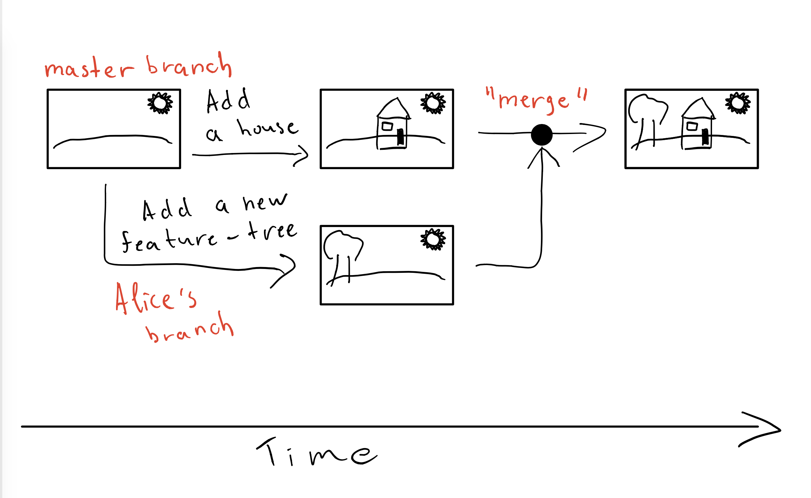

# Git Branching and why does it exist?

Suppose I add a new teammate (a collaborator), which you will learn how to do soon, to my **math-cheat-sheet** repository - Alice.  
Alice wants to add a new feature to the cheat sheet, but I don't want her to break anything while doing so.

I want the feature to be implemented and to work and after that, added to my code base.

Two ways to do this:
- Wait for Alice to complete her work, and after she is done, push it to **math-cheat-sheet**. Which sounds wrong, why?
- Make a separate ***branch*** for Alice and let her work peacefully, while I do my work in parallel.

## What is a branch?

Suppose Alice and I were artists. At the beginning, I have done some basic drawing - a land and a sun.  
From there on, I want to draw a house and Alice wants to draw a tree. How can we do that efficiently, without interfering with each other?

1) Do the work sequentially. I will draw the house first, and then give the list to Alice to draw the tree.
    - But this is slow ;( - a.k.a. inefficient.
2) Make a copy (a.k.a. a ***branch***) of the drawing so far, give the copy to Alice and I will keep the original drawing.  
Alice will draw the tree on the copy and I will draw the house on the ***master branch*** (original) list.  
After we are both ready with our work, we will ***merge*** both drawing by applying them to each other.  

### More abstractly, you can think of this picture when someone says "***branching***":

So a branch is like a parallel world where you can create commit without introducing bugs into production code.  

#### Let's go to the practice now.
