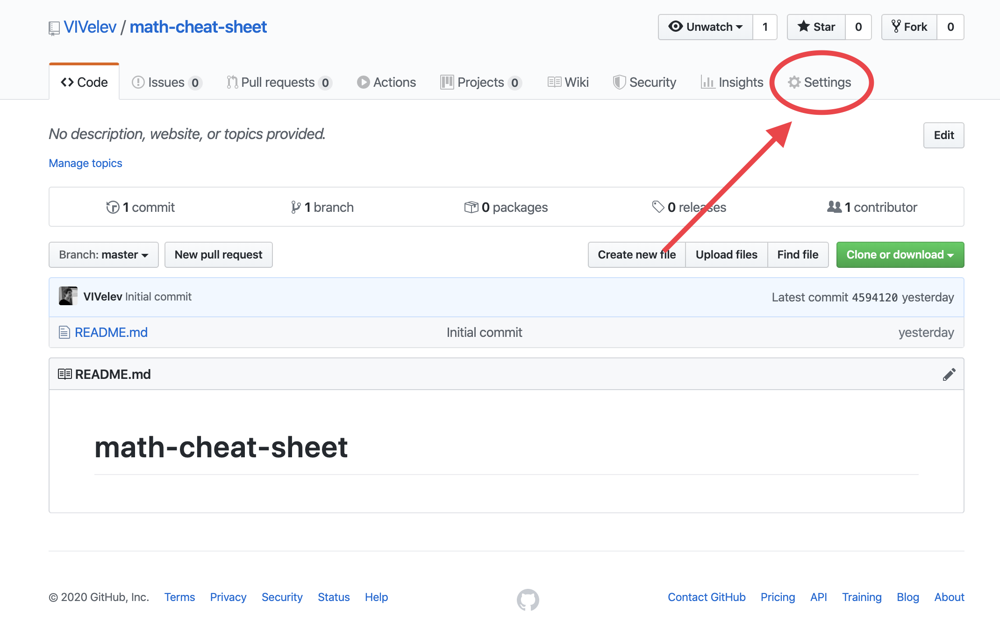
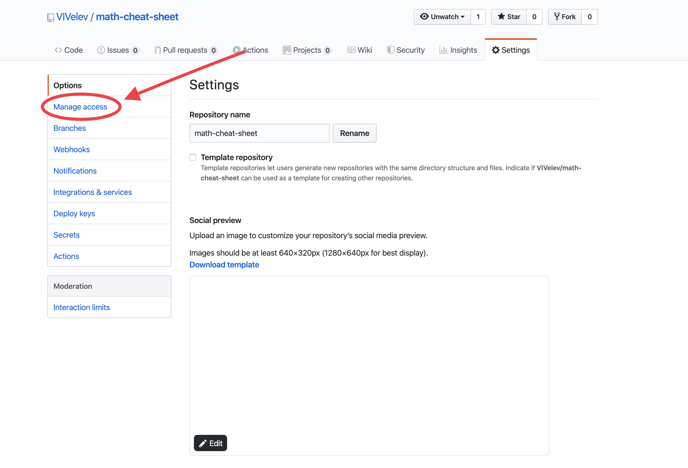
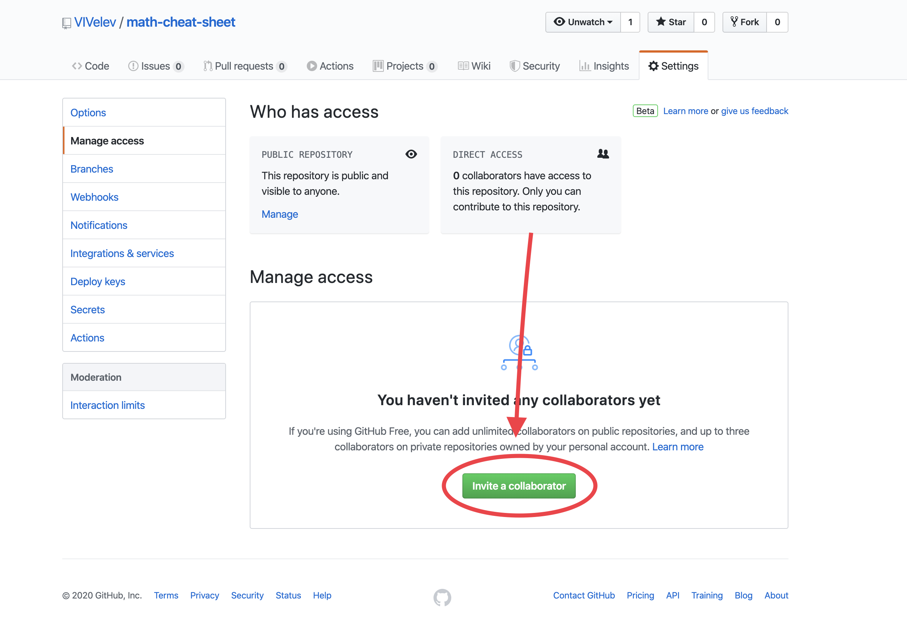

# How to add collaborators?

## Step 1: Go to Settings

## Step 2: Go to Manage Access

## Step 3: Click on Invite a collaborator

# Resolving a merge conflict using the command line
Click [here](https://help.github.com/en/github/collaborating-with-issues-and-pull-requests/resolving-a-merge-conflict-using-the-command-line) for a guide on how to resolve merge conflicts.
