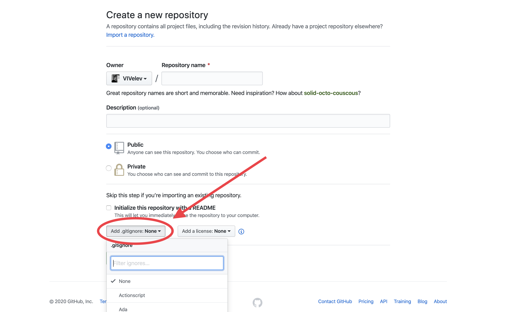

# Ignoring files/directories with gitignore

Suppose we have files in our repository, massive such as ~100GB of photos or useless files, that we do not want
to upload in GitHub.

Luckily, GitHub allows us to deal with this easily. We can ***ignore*** files.

When we ignore a file, we basically say to GitHub: "Hey, I want you not to do anything about this files."
You can think of it as "GitHub can't see this files."

## How to ignore a file/directory?
We have the magical file `.gitignore`

What you have to do is simple: Specify the file/directory pathname in a `.gitignore` file placed in the root folder of your repository.

To ignore a file/directory whose pathname is **path/to/name**, place the following in your `.gitignore` file:
```
path/to/name
```

# Quick Tip
Use predefined `.gitignore` files for the programming language you are using. <br>
Check this out: https://github.com/github/gitignore

### You can specify the `.gitignore` file, for the programming language used, during the creation of the repository:

